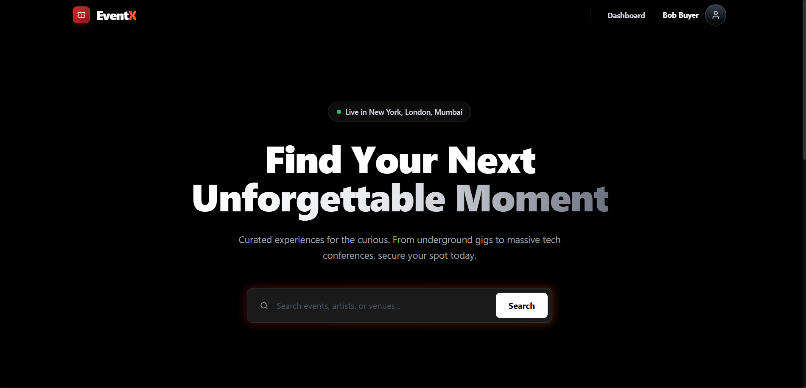

# EventX – Premium Event Management Platform



[](https://event-management-pearl-ten.vercel.app/)
[](https://event-management-1vvo.onrender.com)
[](https://opensource.org/licenses/MIT)

## 🌟 Key Features

### 👤 For Attendees
- Beautiful event discovery with Glassmorphism UI  
- Secure payments via **Razorpay**  
- Cryptographically signed auto-generated QR tickets  
- Personal dashboard: ticket history + cancellation  

### 👔 For Organizers
- Real-time revenue & sales analytics (Recharts)  
- Live attendee check-in tracking  
- Built-in QR code scanner (webcam/mobile friendly)  
- Manual ticket verification support  

### 👮 For Admins
- Platform-wide statistics & monitoring  
- User management (ban / delete users)  

## 🛠️ Tech Stack

- **Frontend**: React (Vite) • Tailwind CSS • Lucide Icons • Recharts • Axios  
- **Backend**: Node.js • Express.js • MongoDB Atlas • Mongoose • JWT  
- **Security**: Helmet • CORS • JWT • Razorpay Verification • QR Code Signing  
- **Payments**: Razorpay (UPI, Cards, Netbanking, Wallets)  
- **Tools**: Vercel • Render  • Postman  

## 📂 Project Structure
```
eventx/
├── backend/
│   ├── src/
│   │   ├── controllers/
│   │   ├── models/
│   │   ├── routes/
│   │   ├── middlewares/
│   │   └── utils/
│   ├── app.js
│   └── .env.example
├── frontend/
│   ├── src/
│   │   ├── components/
│   │   ├── pages/
│   │   ├── services/
│   │   └── assets/
│   ├── main.jsx
│   └── .env.example
└── README.md
```

## 🚀 Quick Start (Local Development)

1. Clone the repository
```bash
git clone https://github.com/your-username/eventx.git
cd eventx
```

### Backend setup
```bash
cd backend
npm install
# Create backend/.env:
# PORT=5000
# MONGO_URI=mongodb+srv://<username>:<password>@cluster.mongodb.net/eventx
# JWT_SECRET=your_super_secure_secret
# JWT_EXPIRES_IN=30d
# QR_SECRET=secret_for_signing_qr_codes
# RAZORPAY_KEY_ID=your_razorpay_key_id
# RAZORPAY_KEY_SECRET=your_razorpay_key_secret
# RAZORPAY_WEBHOOK_SECRET=your_webhook_secret
npm start
# or for development with auto-restart:
npm run dev
```

### Frontend setup
```bash
cd ../frontend
npm install
# Create frontend/.env:
# VITE_API_URL=http://localhost:5000/api/v1
# For production:
# VITE_API_URL=https://your-backend.onrender.com/api/v1
npm run dev
```

## 📡 API Endpoints Overview
Base URL: `/api/v1`

### Authentication
- `POST /auth/register`
- `POST /auth/login`
- `GET /auth/me`

### Events
- `GET /events`
- `GET /events/:id`
- `POST /events` (Organizer/Admin)
- `PATCH /events/:id` (Organizer/Admin)
- `DELETE /events/:id` (Organizer/Admin)

### Bookings & Tickets
- `POST /bookings/book`
- `POST /bookings/verify`
- `POST /bookings/cancel-ticket`
- `GET /bookings/my-tickets`

### Organizer Tools
- `GET /organizer/events/:id/analytics`
- `GET /organizer/events/:id/attendees`
- `POST /organizer/scan`
- `POST /organizer/manual-checkin`

### Admin
- `GET /admin/stats`
- `GET /admin/users`
- `DELETE /admin/users/:id`

### Webhooks
- `POST /webhooks/razorpay`

## 🤝 Contributing

1. Fork the project
2. Create your feature branch: `git checkout -b feature/amazing-feature`
3. Commit your changes: `git commit -m 'Add some amazing feature'`
4. Push to the branch: `git push origin feature/amazing-feature`
5. Open a Pull Request

## 👨‍💻 Developed By
ANIRBAN JANA